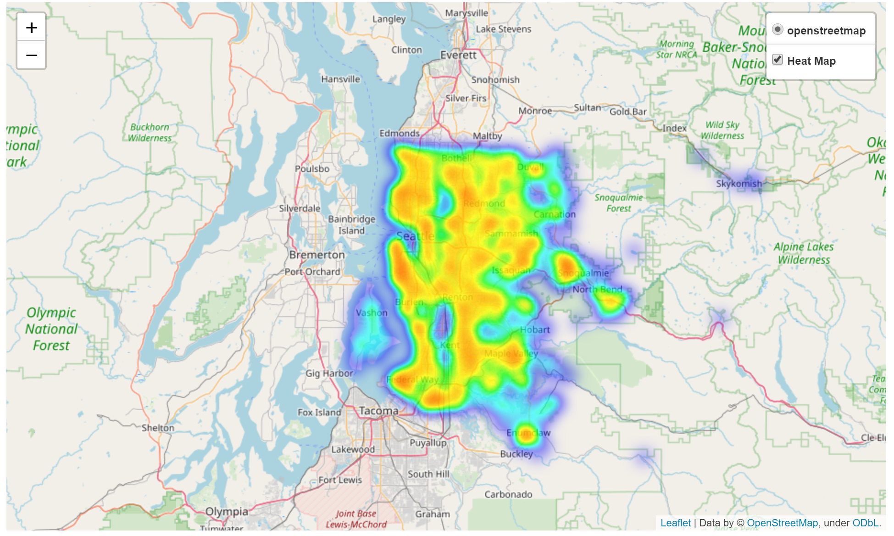

# Predicting house price in King County, WA, USA

Exploratory data analysis and price prediction on the King county (WA) house price data set. The complete analysis can be found in this [notebook](Final_Jerry.ipynb).

## Price heat map
The heat map is rendered by `folium`, which is not natively supported by GitHub. If you want to view the dynamic heat map, please use [this LINK](https://nbviewer.jupyter.org/github/jerrychens/king_county_house_price/blob/master/Final_Jerry.ipynb) supported by nbviewer.

This is a screenshot of the heat map.

## Pacakge required

`folium` for the geo heat map. Installation `pip install folium`.

Other common packages:
`pandas`, `numpy`, `seaborn`, `statsmodels.api`, `sklearn`, `matplotlib`

## Dataset Description

This dataset contains house sale prices for King County, which includes Seattle. It includes homes sold between May 2014 and May 2015. It's a great dataset for evaluating regression models.

The dataset is retrieved from [Kaggle](https://www.kaggle.com/harlfoxem/housesalesprediction). It is published on 08/25/2016.
The source is believed to be reliable because all housing information is public data. It is a famous dataset, and the features are complete. 

Along with house price (target) it consists of an ID, date, and 18 house features.

1. `Id`:  Unique ID for each home sold
2. `Date`: Date of the home sale
3. `Price`: Price of each home sold (target)
4. `Bedrooms`: Number of bedrooms
5. `Bathrooms`: Number of bathrooms, where .5 accounts for a room with a toilet but no shower
6. `Sqft_living`: Square footage of the apartments interior living space
7. `Sqft_lot`: Square footage of the land space
8. `Floors`: Number of floors
9. `Waterfront`: A dummy variable for whether the apartment was overlooking the waterfront or not
10.`View`: An index from 0 to 4 of how good the view of the property was
11.`Condition`: An index from 1 to 5 on the condition of the apartment,
12. `Grade`: An index from 1 to 13, where 1-3 falls short of building construction and design, 7 has an average level of construction and design, and 11-13 have a high quality level of construction and design
13. `Sqft_above`: The square footage of the interior housing space that is above ground level
14. `Sqft_basement`: The square footage of the interior housing space that is below ground level
15. `Yr_built`: The year the house was initially built
16. `Yr_renovated`: The year of the house’s last renovation
17. `Zipcode`: What zipcode area the house is in
18. `Lat`: Lattitude
19. `Long`: Longitude
20. `Sqft_living15`: The square footage of interior housing living space for the nearest 15 neighbors
21. `Sqft_lot15`: The square footage of the land lots of the nearest 15 neighbors

## Conclusions

1. The price (target) has many outliers, and it is positively skewed, which makes it hard to generate a proper model to predict the price. 
2. From EDA, we understand several key findings:
 - (1) The living square footage is highly correlated with the price.
 - (2) The grade is highly correlated with the price
 - (3) The number of bathrooms positively correlated with the price.
 - (4) The view also determines the price.
 - (5) Since most people don't have a basement, so square footage above the ground is correlated with the living square footage.
 - (6) Usually, the neighborhood has a similar size of the living space.
 - (7) The age of the house doesn't have a clear trend contributing to the price.
 - (8) The house with the renovation can sell slightly higher than the houses they don't.
3. The linear model with or without the regularization performs similarily. With MinMaxScaling of 16 selected features, the R^2 score is around 65.8% accurate for three linear models.
 - (1) Three models have a similar value of the intercept
 - (2) The sign and magnitude of the coefficient (of lasso regression) are generally matched with what we've observed in the EDA.

## Future work:  
Base on the above findings, we found out that linear models have limitations to capture the trend of the price. Although it gave us a decent price prediction (about 65% accurate), it cannot capture the non-linearity of the nature of the housing price. The score can be improved if we try non-linear models such as Random Forest, XGboost, Neural Network, etc.
